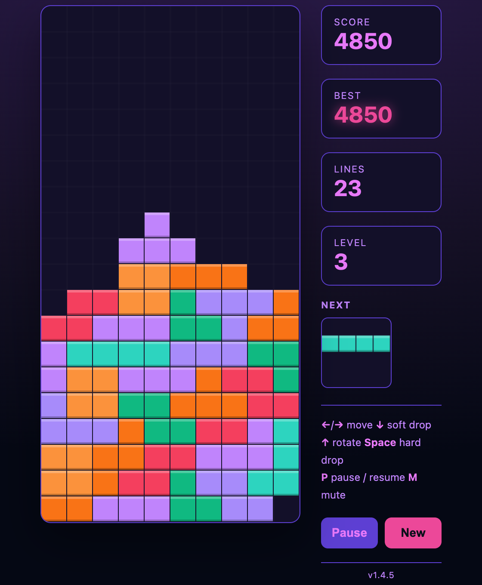

# omarchy-tetris

A single-file HTML Tetris game — no build step, no dependencies. Open `tetris.html` in any browser and play.

## ▶ Play it live

[](https://ulfmoby.github.io/omarchy-tetris/)

Click the picture above to load the game in your browser (hosted on GitHub Pages).

## Play locally

```bash
xdg-open index.html
```

## Controls

| Key | Action |
|-----|--------|
| ← / → | Move left / right |
| ↓ | Soft drop |
| ↑ | Rotate |
| Space | Hard drop |
| P | Pause / resume |

## Features

- Full 10×20 board, all 7 standard pieces (I, O, T, S, Z, J, L)
- Next-piece preview
- Score, lines cleared, and levels that speed up as you play
- Pause, restart, and a clean dark frosted-glass look

---

> 🧊 *Another ~10-minute vibe-coded delight by Ulf — should not be trusted with a keyboard.*
